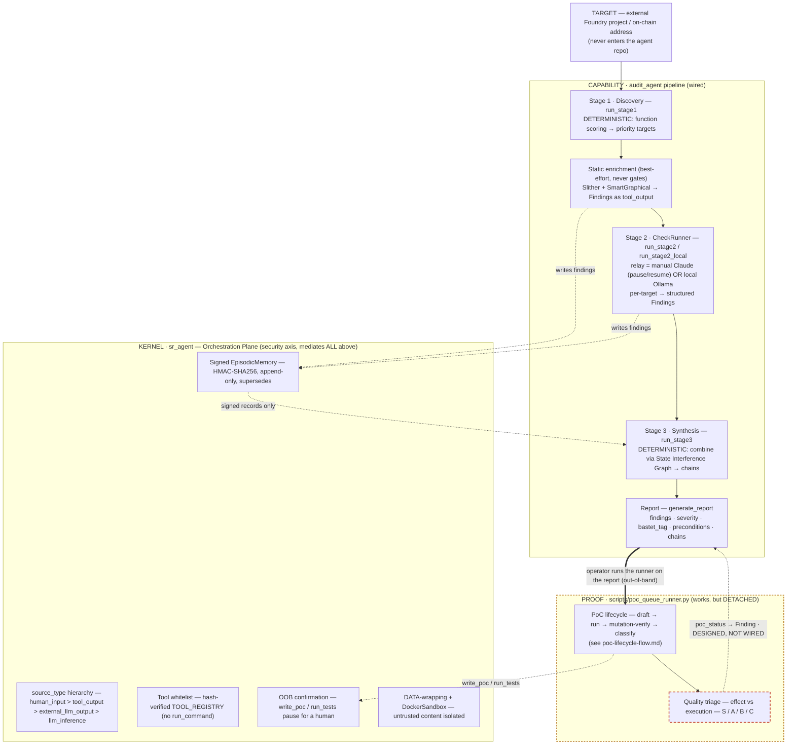

# Agent overview — the whole agent, end to end

> 🇷🇺 Русская версия: [agent-overview-flow.ru.md](agent-overview-flow.ru.md)

The audit agent has **two axes**, and the PoC work most of these docs zoom into is one
block on the first:

1. **Capability** — the `audit_agent` pipeline that turns a target into findings + a report
   (Discovery → CheckRunner → Synthesis).
2. **Security** — the kernel (`sr_agent`) Orchestration Plane that wraps *every* step:
   signed memory, source-type hierarchy, tool whitelist, out-of-band confirmation,
   DATA-wrapping. This is the research contribution (MI-resistance, ASR ≤ 5%).

PoC generation is a **downstream proof layer** ([poc-lifecycle-flow.md](poc-lifecycle-flow.md)
is the zoom into that one block). This doc is the map it sits inside.

- **Solid spine** (T → S1 → … → REP) and the **KERNEL** block are wired and running.
- **Amber dashed** = the PROOF layer works but is a **separate process**: an operator runs
  `poc_queue_runner.py` on a report; nothing calls it from the pipeline.
- **Red dashed** (`TRI`, and the `poc_status → Finding` edge) = **not automated**: the triage
  is manual, and the write-back into the `Finding` is designed (the slots exist) but unwired.

## Capability axis — stage table

| Stage | Actions | What it needs to work | In code today |
|-------|---------|-----------------------|---------------|
| **Target intake** | Bind an external Foundry project or on-chain address; findings/PoCs live outside this repo | `POC_PROJECT`/audit root; on-chain provider key for address audits | ✅ `AuditInput`, `_context_provider`; hard repo boundary (audit-agent.md) |
| **Stage 1 · Discovery** | Extract functions, score risk, emit a prioritized target list | Source tree readable | ✅ `run_stage1` (`extract_functions`, `score_function`) — **deterministic**, not LLM-ReAct |
| **Static enrichment** | Run Slither + SmartGraphical; store results as `tool_output` (more trusted than relayed LLM) | Docker + Slither image; `SR_SMARTGRAPHICAL_ROOT` for the structural pass | ✅ `_run_static_analysis`, `_run_smartgraphical_analysis` — best-effort, never gates |
| **Stage 2 · CheckRunner** | Per-target vulnerability analysis → structured `Finding`s (bastet_tag, 12 preconditions, severity) | A model: relay (manual Claude, pause/resume) **or** local Ollama; a context provider | ✅ `run_stage2` (relay) / `run_stage2_local` (Ollama). README's "Qwen3-4B fine-tuned" is the intended local model |
| **Stage 3 · Synthesis** | Build a State Interference Graph per file; combine findings that share state into attack chains | The findings + per-file SIG (SmartGraphical graph or regex fallback) | ✅ `run_stage3`, `build_sig` / `build_sig_from_smartgraphical` — **deterministic** |
| **Report** | Render findings + severities + combination chains to markdown | Findings in memory | ✅ `generate_report`; severity guardrail (`guardrails/severity`), mock-detect (`guardrails/mock_detect`) |
| **PROOF · PoC lifecycle** | For each finding, draft → run → mutation-verify → classify a Foundry PoC | Target deploy scaffold + fork RPC; a model. **Run as a separate script** on the report | ✅ `scripts/poc_queue_runner.py` (full lifecycle in poc-lifecycle-flow.md) — **detached from the pipeline** |
| **PROOF · Quality triage** | Judge whether each PoC's assertions bind to the effect vs the fact of execution; tier S/A/B/C; write `poc_status` back to the `Finding` | A human read, or a test-side mutation oracle (poc-lifecycle-flow.md §future) | ⚠️ **MANUAL**; write-back is **designed** (`Finding.poc_path`/`poc_status` exist) but **unwired** |

## Security axis — kernel (`sr_agent`) cross-cutting

| Guarantee | Actions | What it needs to work | In code today |
|-----------|---------|-----------------------|---------------|
| **Signed memory** | Every `MemoryRecord` HMAC-SHA256 signed by the orchestrator; invalid signatures dropped before LLM context; append-only, corrections via `supersedes` | `SR_SECRET_KEY` in the orchestration plane only | ✅ `sr_agent/memory` (EpisodicMemory), `models/memory` |
| **Source-type hierarchy** | Provenance on every record; privileged statuses (`verified_safe`, `skip_analysis`) require `human_input` — an LLM can't self-grant them | — | ✅ `models/SourceType`; enforced on write |
| **Tool whitelist** | Named typed tools only (no `run_command`); descriptions hash-verified against `TOOL_REGISTRY` at startup (supply-chain guard) | Registry present | ✅ `sr_agent/tools/registry`; pack registers `tools=TOOL_REGISTRY.values()` |
| **OOB confirmation** | Irreversible actions (`write_poc`, `run_tests`, `deploy_test_contract`) pause; a separate CLI invocation approves | The confirm surface (`sr-agent confirm` / frontend) | ✅ `dispatch.execute_confirmed`, kernel orchestrator; frontend `confirm.py` |
| **DATA-wrapping + sandbox** | External content wrapped `[DATA START]…[DATA END]`; tool execution in `DockerSandbox` (`--network none`, cap-drop) | Docker | ✅ `sr_agent/guardrails/sanitize`, `sr_agent/tools/sandbox` |
| **Pack boundary** | The pack registers tools/prompts/escalation but cannot skip the gate, forge a trust tier, or write memory directly | — | ✅ `audit_agent/pack.py` (`AUDIT_PACK`); arch test asserts the kernel imports zero pack modules |

## Surfaces (composition roots)

| Surface | What it drives | State |
|---------|----------------|-------|
| **CLI** — `sr-agent audit` / `chat` / `confirm` / `memory` / `demo-attack` | Batch pipeline + interactive audit chat + MI attack self-test | ✅ wired |
| **Operator frontend** (`frontend/`, FastAPI + Svelte) | Run/observe/approve solo, model-config, live trace | ✅ present (`app.py`, `sessions.py`, `confirm.py`, `clone.py`) |
| **PoC-workability runner** (`scripts/poc_queue_runner.py`) | The standalone PoC experiment on an external report | ✅ wired, **detached** from the pipeline |

## Wired vs vision — read this before trusting the picture

The README states the aspiration; the code is the source of truth. Where they differ:

- **Stage 1/3 are deterministic in the wired code**, not "Claude Opus ReAct + extended
  thinking" as the README's pipeline sketch says. The LLM concentration in the wired
  pipeline is Stage 2 (relay/local) plus the enrichment analyzers. The Opus-ReAct framing
  fits the interactive `sr-agent chat` surface / the broader design, not `pipeline.py`.
- **Stage 2's default is the relay channel** (manual Claude, pause/resume). "Qwen3-4B
  fine-tuned, local, code never leaves the machine" is the intended local backend
  (`run_stage2_local`), not the default path.
- **`pipeline.py`'s own docstring is stale** ("Stage 3 … not wired here yet"): `_finish`
  does call `run_stage3`. Stage 3 **is** wired.
- **The PROOF layer is detached.** `poc_queue_runner.py` reads an external report and writes
  PoCs into the external target; it does **not** import the pipeline, read its memory, or
  write `poc_status` back onto the `Finding`. The integration slots exist
  (`Finding.poc_path` / `poc_status`) — closing that loop is the obvious next wiring step,
  and it is where the manual triage would become a pipeline stage.

## The one gap worth naming

The pipeline **claims** findings; the PROOF layer **demonstrates** them — but the two do not
talk. A finding's `poc_status` is set by hand, from a run of a separate script, filtered by a
manual S/A/B/C triage. Wiring PROOF back onto the `Finding` (and automating the triage via a
test-side mutation oracle — see poc-lifecycle-flow.md §"intended automation") would make the
agent close its own loop: claim → prove → label, end to end, under the same kernel guarantees.

## Related

- [poc-lifecycle-flow.md](poc-lifecycle-flow.md) — zoom into the PROOF block (stages 1–15)
- [poc-writing-flow.md](poc-writing-flow.md) — the inner draft→compile→fix loop
- [../audit-agent.md](../audit-agent.md) — the pack and its surfaces
- [architecture-overview.md](architecture-overview.md) — kernel/pack module map
- `audit_agent/pipeline.py`, `audit_agent/pack.py`, `audit_agent/finding.py`
