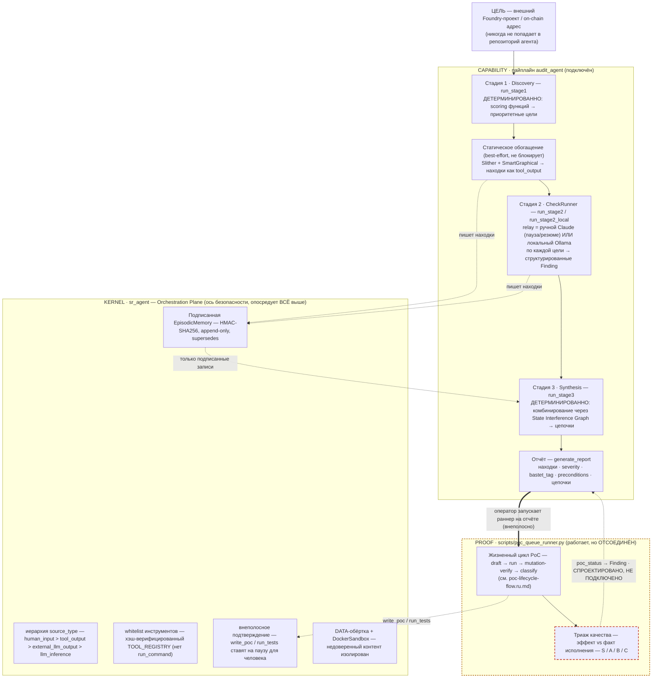

# Обзор агента — весь агент целиком, от начала до конца

> 🇬🇧 English version: [agent-overview-flow.md](agent-overview-flow.md)

У аудит-агента **две оси**, и PoC-работа, в которую углубляется большинство этих доков, —
лишь один блок на первой из них:

1. **Capability (способность)** — пайплайн `audit_agent`, который превращает цель в находки +
   отчёт (Discovery → CheckRunner → Synthesis).
2. **Security (безопасность)** — ядро (`sr_agent`), Orchestration Plane, оборачивающее *каждый*
   шаг: подписанная память, иерархия источников, whitelist инструментов, внеполосное
   подтверждение, DATA-обёртка. Это и есть research-вклад (устойчивость к Memory Injection,
   ASR ≤ 5%).

Генерация PoC — это **downstream-слой доказательства** ([poc-lifecycle-flow.ru.md](poc-lifecycle-flow.ru.md)
даёт зум именно в этот блок). Данный док — карта, внутри которой он находится.

- **Сплошной хребет** (T → S1 → … → REP) и блок **KERNEL** — подключены и работают.
- **Янтарный пунктир** = слой PROOF работает, но это **отдельный процесс**: оператор запускает
  `poc_queue_runner.py` на отчёте; из пайплайна его никто не вызывает.
- **Красный пунктир** (`TRI` и ребро `poc_status → Finding`) = **не автоматизировано**: триаж
  делается вручную, а запись обратно в `Finding` спроектирована (слоты есть), но не подключена.

## Ось Capability — таблица стадий

| Стадия | Действия | Что необходимо для работоспособности | Что есть в коде сейчас |
|--------|----------|--------------------------------------|------------------------|
| **Приём цели** | Привязать внешний Foundry-проект или on-chain адрес; находки/PoC живут вне этого репо | Корень аудита `POC_PROJECT`; ключ провайдера для аудита адреса | ✅ `AuditInput`, `_context_provider`; жёсткая граница репо (audit-agent.md) |
| **Стадия 1 · Discovery** | Извлечь функции, оценить риск, выдать приоритизированный список целей | Читаемое дерево исходников | ✅ `run_stage1` (`extract_functions`, `score_function`) — **детерминированно**, не LLM-ReAct |
| **Статическое обогащение** | Запустить Slither + SmartGraphical; сохранить как `tool_output` (доверия больше, чем к relay-LLM) | Docker + образ Slither; `SR_SMARTGRAPHICAL_ROOT` для структурного прохода | ✅ `_run_static_analysis`, `_run_smartgraphical_analysis` — best-effort, никогда не блокирует |
| **Стадия 2 · CheckRunner** | Анализ уязвимостей по каждой цели → структурированные `Finding` (bastet_tag, 12 preconditions, severity) | Модель: relay (ручной Claude, пауза/резюме) **или** локальный Ollama; провайдер контекста | ✅ `run_stage2` (relay) / `run_stage2_local` (Ollama). «Qwen3-4B fine-tuned» из README — это задуманная локальная модель |
| **Стадия 3 · Synthesis** | Построить State Interference Graph по файлу; объединить находки, делящие состояние, в цепочки атак | Находки + SIG по файлу (граф SmartGraphical или regex-fallback) | ✅ `run_stage3`, `build_sig` / `build_sig_from_smartgraphical` — **детерминированно** |
| **Отчёт** | Отрендерить находки + severity + цепочки комбинаций в markdown | Находки в памяти | ✅ `generate_report`; guardrail по severity (`guardrails/severity`), mock-detect (`guardrails/mock_detect`) |
| **PROOF · Жизненный цикл PoC** | Для каждой находки: draft → run → mutation-verify → classify Foundry-PoC | Deploy-скаффолд цели + fork-RPC; модель. **Запускается отдельным скриптом** по отчёту | ✅ `scripts/poc_queue_runner.py` (полный цикл в poc-lifecycle-flow.ru.md) — **отсоединён от пайплайна** |
| **PROOF · Триаж качества** | Оценить, бьют ли ассерты в эффект vs в факт исполнения; тир S/A/B/C; записать `poc_status` обратно в `Finding` | Человеческое чтение или тест-side мутационный оракул (poc-lifecycle-flow.ru.md §будущее) | ⚠️ **ВРУЧНУЮ**; запись обратно **спроектирована** (`Finding.poc_path`/`poc_status` есть), но **не подключена** |

## Ось Security — сквозное ядро (`sr_agent`)

| Гарантия | Действия | Что необходимо для работоспособности | Что есть в коде сейчас |
|----------|----------|--------------------------------------|------------------------|
| **Подписанная память** | Каждая `MemoryRecord` подписана HMAC-SHA256 оркестратором; невалидные подписи отбрасываются до попадания в контекст LLM; append-only, коррекции через `supersedes` | `SR_SECRET_KEY` только в orchestration plane | ✅ `sr_agent/memory` (EpisodicMemory), `models/memory` |
| **Иерархия источников** | Provenance на каждой записи; привилегированные статусы (`verified_safe`, `skip_analysis`) требуют `human_input` — LLM не может выдать их себе сам | — | ✅ `models/SourceType`; проверяется при записи |
| **Whitelist инструментов** | Только именованные типизированные инструменты (нет `run_command`); описания хэш-верифицируются против `TOOL_REGISTRY` на старте (защита от supply-chain) | Наличие реестра | ✅ `sr_agent/tools/registry`; пак регистрирует `tools=TOOL_REGISTRY.values()` |
| **Внеполосное подтверждение** | Необратимые действия (`write_poc`, `run_tests`, `deploy_test_contract`) ставятся на паузу; подтверждает отдельный вызов CLI | Поверхность confirm (`sr-agent confirm` / фронтенд) | ✅ `dispatch.execute_confirmed`, оркестратор ядра; фронтенд `confirm.py` |
| **DATA-обёртка + sandbox** | Внешний контент обёрнут `[DATA START]…[DATA END]`; исполнение инструментов в `DockerSandbox` (`--network none`, cap-drop) | Docker | ✅ `sr_agent/guardrails/sanitize`, `sr_agent/tools/sandbox` |
| **Граница пака** | Пак регистрирует инструменты/промпты/эскалацию, но не может пропустить гейт, подделать trust-tier или писать в память напрямую | — | ✅ `audit_agent/pack.py` (`AUDIT_PACK`); арх-тест утверждает, что ядро не импортирует ни одного модуля пака |

## Поверхности (composition roots)

| Поверхность | Что приводит в действие | Статус |
|-------------|-------------------------|--------|
| **CLI** — `sr-agent audit` / `chat` / `confirm` / `memory` / `demo-attack` | Батч-пайплайн + интерактивный аудит-чат + self-test MI-атак | ✅ подключено |
| **Фронтенд оператора** (`frontend/`, FastAPI + Svelte) | Запуск/наблюдение/подтверждение соло, конфиг модели, живой трейс | ✅ присутствует (`app.py`, `sessions.py`, `confirm.py`, `clone.py`) |
| **PoC-workability раннер** (`scripts/poc_queue_runner.py`) | Отдельный PoC-эксперимент по внешнему отчёту | ✅ подключено, **отсоединён** от пайплайна |

## Wired vs vision — прочти это, прежде чем доверять картине

README формулирует замысел; истина — код. Где они расходятся:

- **Стадии 1/3 в подключённом коде детерминированные**, а не «Claude Opus ReAct + extended
  thinking», как говорит набросок пайплайна в README. Концентрация LLM в подключённом пайплайне
  — это Стадия 2 (relay/local) плюс анализаторы обогащения. Формулировка Opus-ReAct подходит
  интерактивной поверхности `sr-agent chat` / более широкому замыслу, но не `pipeline.py`.
- **Дефолт Стадии 2 — relay-канал** (ручной Claude, пауза/резюме). «Qwen3-4B fine-tuned,
  локально, код не покидает машину» — это задуманный локальный бэкенд (`run_stage2_local`), а
  не дефолтный путь.
- **Собственный docstring `pipeline.py` устарел** («Stage 3 … not wired here yet»): `_finish`
  вызывает `run_stage3`. Стадия 3 **подключена**.
- **Слой PROOF отсоединён.** `poc_queue_runner.py` читает внешний отчёт и пишет PoC во внешнюю
  цель; он **не** импортирует пайплайн, не читает его память и не пишет `poc_status` обратно в
  `Finding`. Слоты интеграции есть (`Finding.poc_path` / `poc_status`) — закрыть этот контур и
  есть очевидный следующий шаг подключения, и именно там ручной триаж стал бы стадией пайплайна.

## Один разрыв, который стоит назвать

Пайплайн **заявляет** находки; слой PROOF их **демонстрирует** — но они не разговаривают друг с
другом. `poc_status` находки выставляется вручную, по запуску отдельного скрипта, отфильтрованному
ручным триажем S/A/B/C. Подключение PROOF обратно к `Finding` (и автоматизация триажа через
тест-side мутационный оракул — см. poc-lifecycle-flow.ru.md §«задуманная автоматизация») замкнёт
собственный контур агента: заявил → доказал → пометил, от начала до конца, под теми же гарантиями
ядра.

## Связанное

- [poc-lifecycle-flow.ru.md](poc-lifecycle-flow.ru.md) — зум в блок PROOF (стадии 1–15)
- [poc-writing-flow.md](poc-writing-flow.md) — внутренний цикл draft→compile→fix (пока только EN)
- [../audit-agent.md](../audit-agent.md) — пак и его поверхности (пока только EN)
- [architecture-overview.md](architecture-overview.md) — карта модулей ядра/пака (пока только EN)
- `audit_agent/pipeline.py`, `audit_agent/pack.py`, `audit_agent/finding.py`
