# Обзор архитектуры — ядро, пак и поверхности, которые их приводят в действие

> 🇬🇧 English version: [architecture-overview.md](architecture-overview.md)

Что реально подключено сегодня — после **разделения ядро ↔ capability-пак** (спека 004) и
**фронтенда оператора** (спека 005). Два composition roots (CLI и фронтенд) собирают одно и то
же таск-агностичное [ядро](https://github.com/RamilRamil/secure-agent-kernel) и передают ему [аудит-пак](../audit-agent.ru.md).
Отдельный скрипт запускает PoC-эксперимент вне петли.

```mermaid
flowchart TB
    subgraph ROOTS["Composition roots"]
        CLI["audit_agent/cli.py<br/>chat · confirm · relay · memory · audit"]
        FE["frontend/backend/app.py<br/>консоль оператора FastAPI + Svelte"]
    end

    subgraph KERNEL["Ядро — таск-агностичное (не импортирует ни одного пака)"]
        LOOP["orchestrator/loop.py<br/>OrchestratorLoop.run_turn (ReAct)"]
        ACT["orchestrator/action.py<br/>validate_action — OOB-гейт из action_class"]
        CONF["orchestrator/confirmation.py<br/>внеполосное одобрение"]
        CTX["orchestrator/context.py<br/>DATA-обёртка каждого хода"]
        PACKIF["orchestrator/pack.py<br/>CapabilityPack + PackContext"]
        GUARD["guardrails/{sanitize,escalation}<br/>общие триггеры"]
        MEM["memory/episodic.py<br/>HMAC append-only, SourceType"]
        LLM["llm_core/{local_client,claude_client,gemini_client,<br/>openrouter_client,router,chat_reasoning}"]
        SAND["tools/sandbox.py<br/>--network none, эфемерный"]
    end

    subgraph PACK["audit_agent — аудит capability-пак"]
        APACK["pack.py → AUDIT_PACK"]
        ADISP["dispatch.py · reasoning.py · escalation.py"]
        APIPE["pipeline.py · planner/ (stage1-3)"]
        ATOOLS["tools/{static_analysis,smartgraphical,<br/>onchain,write_execute}"]
        AMODEL["finding.py (Severity/SIG) · report.py"]
    end

    subgraph EXP["scripts/poc_queue_runner.py — эксперимент PoC-workability"]
        RUNNER["отдельно: модель извлекает находки →<br/>grounded-драфт → компиляция в sandbox → цикл fix"]
    end

    CLI --> LOOP
    FE --> LOOP
    LOOP --> ACT --> CONF
    LOOP --> CTX
    LOOP --> GUARD
    LOOP --> MEM
    LOOP --> LLM
    LOOP -->|"узкий PackContext"| PACKIF
    APACK -->|"инъектируется в"| PACKIF
    APACK --> ADISP & APIPE & ATOOLS & AMODEL
    ATOOLS -->|"write_execute ⇒ OOB-гейт"| ACT
    ATOOLS --> SAND
    RUNNER --> LLM
    RUNNER --> SAND
```

## Как это читать

- **Ядро — это подключённое сердце, а не сирота.** `OrchestratorLoop.run_turn` достижимо обоими
  composition roots (`sr-agent chat` и фронтенд оператора). Оно владеет потоком управления и
  каждым инвариантом; см. [chat-turn-flow.ru.md](chat-turn-flow.ru.md) для одного хода подробно.
- **Граница реальна и покрыта тестом.** Ни один модуль ядра не импортирует `sr_agent.packs`
  (арх-тест). Аудит-пак достаёт ядро через единственный `CapabilityPack`, который он собирает как
  `AUDIT_PACK`; ядро выдаёт вызываемым пака только узкий `PackContext` (никогда петлю, никогда
  хэндл записи в память).
- **OOB-гейт подтверждения выводится ядром.** `validate_action` требует внеполосного одобрения
  всякий раз, когда `action_class == write_execute` (`write_poc`/`run_tests`/`deploy_test_contract`
  аудит-пака). Пак не может пометить такое действие как skip-confirmation — у него нет для этого
  поля.
- **`scripts/poc_queue_runner.py` — отдельный эксперимент**, а не агент: он напрямую приводит
  `LocalClient` + sandbox, чтобы проверить, может ли локальная модель писать PoC end-to-end. Он
  намеренно обходит `validate_action` для низкорискового случая — записи тестового файла во
  внешний git-клон и запуска `forge test --network none` (залогированное упрощение) — реальное
  действие в chat-режиме не должно повторять этот срез.
- **Аудируемая цель живёт целиком вне этого репо** (см. [audit-agent.ru.md](../audit-agent.ru.md));
  пак читает её в рантайме.
