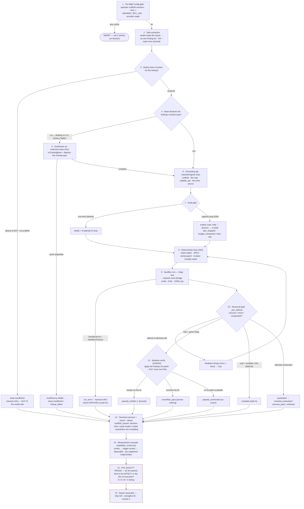

# PoC lifecycle — end-to-end agent flow (current + intended)

> 🇷🇺 Русская версия: [poc-lifecycle-flow.ru.md](poc-lifecycle-flow.ru.md)

The full path a finding travels through `scripts/poc_queue_runner.py`: from report to a
per-finding verdict, then through the measurement layer, and finally to the **quality
triage** that decides what actually goes in a report. Stages 1–13 are **wired and running
today**; stages 14–15 are **where today's judgement is still manual** — see
[Where quality triage fits](#where-quality-triage-fits).

Inner draft→compile→fix loop detail: [poc-writing-flow.md](poc-writing-flow.md).
Cause→nature accounting: `scripts/scaffold_causes.py`. Measurement cascade:
`scripts/capability_screen.py`. Operator prerequisites: [../poc-target-prerequisites.md](../poc-target-prerequisites.md).

Dashed red (14–15) = **not automated**: today these are a manual read (this run's
`POC_TRIAGE.md`). Everything above is code.

## Stage table

| Stage | Actions | What it needs to work | In code today |
|-------|---------|-----------------------|---------------|
| **1 · Pre-flight gate** | Reject a set-but-unresolved `--test-scaffold` (typo); require `MAINNET_RPC_URL` under `--fork`; warm/ready the provider | Operator env: `POC_PROJECT`, `POC_REPORT`, RPC (fork), provider key or Ollama up | ✅ `_preflight_operator_scaffold`, `main()` fork/provider checks → `exit 2` (spec 001 FR-011) |
| **2 · Task extraction** | Model reads the report and composes its own finding list; or load a pinned list | Report file; a model; or a `--tasks-from` JSON | ✅ `extract_tasks` / `load_pinned_tasks`; persisted to `<target>/audit/poc/_extracted_tasks.json` |
| **3 · Base resolution** | Auto-discover the most-inherited `*Base` (or operator scaffold); absent base ⇒ short-circuit to `base-insufficient` before the type gate | A git-tracked deploy base **or** `--test-scaffold`; else honest environment terminal | ✅ `resolve_scaffold`; absent-base short-circuit (`scaffold_absent`). **spec 001** reconciling the doc/taxonomy wording |
| **4 · Missing-type gate** | Detect that the base declares no state var of the finding's type; forbid drafting on a known-insufficient base | AST `SymbolIndex`; the finding's target stems | ✅ `scaffold_missing_types` (feature 040 FR-011) |
| **5 · Scaffold synthesis** | Synthesize `is ExistingBase` that deploys the missing type, compile-validate, draft on it if it builds; else split `base-insufficient` vs `lookup_failed` | Symbol index + lookup budget > 0; a compilable extension | ✅ `synthesize_scaffold` (011); `_insufficiency_ladder_outcome` |
| **6 · Grounding** | Assemble scaffold + project file map + real `callable_api` signatures + a different-finding few-shot + source | Original (git-tracked) target code only — never answer PoCs | ✅ `_grounding`, `build_file_manifest`, `build_callable_api`, `resolve_example` |
| **7 · Draft** | Either one-shot `draft()` then an N-attempt fix loop, or the opt-in agentic read→observe→re-draft loop | A model; `--agentic-loop` for path B; loop budgets/spin/retry-cap | ✅ `draft` / `fix`; `_run_agentic_exploit_loop` + `exploit_loop.run` (036/037) |
| **8 · Deterministic fixes** | Mechanically correct import depth, SPDX, non-virtual `setUp`, known undeclared imports — in code, not by prompting | The file map + symbol index | ✅ `_seq_postmodel`, `_seq_draft_inplace` (032); does not consume the attempt budget |
| **9 · Sandbox run** | `forge test` in `DockerSandbox` (`--network none`, or bridge under `--fork`); 600s cap, ×2 under fork | Foundry image (baked solc for offline); ≥6g memory for `via_ir`; RPC for fork | ✅ `run_tests`, `_harness_sandbox`; `SandboxError`/`Timeout` → `run_error` (**crash fix**) |
| **10 · Structural gate** | Reject vacuous / target-mocked / unimported PoCs; classify compiled vs green; feed forge errors + targeted/revert hints back to `fix()` | Defect heuristics; forge output | ✅ `_poc_defects`, `_targeted_hints`, `revert_hints`, stall/repeat detection (042/045) |
| **11 · Mutation-verify** | Apply the finding's fix-patch to an ephemeral target copy; a real proof must now FAIL. Survives ⇒ `unverified_pass`; no patch ⇒ `passed_unchecked` | A **real fix-patch** per finding (report fix or `--fix-patch`) — exists only for H-01..H-05 here | ✅ `mutation_verify` (010/025). **The oracle — but only where a fix-patch exists** |
| **12 · Terminal + nature** | Emit the finding-attempt terminal with a closed-set cause; map cause→nature; quarantine non-compiling PoCs out of `poc/` | The cause map | ✅ `_finding_cause`/`_terminal_fields`; `scaffold_causes.cause_nature` (3 natures) |
| **13 · Measurement cascade** | smoke (plumbing) → trigger-screen (triggered?) → Bayes@N over a battery; pre-registered subject/class so infra failures don't inflate the rate | A pre-registration record; repeated runs for Bayes@N | ✅ `capability_screen.py` (`run_cascade`, `oracle_verdict_hash`, prereg) |
| **14 · Quality triage** | Judge whether each PoC's assertions bind to the **effect** (differential — would fail if the bug were absent) or merely to the **fact of execution**; tier S/A/B/C | A human read, **or** a test-side mutation oracle for no-fix findings (see below) | ⚠️ **MANUAL today** — no code. `passed_unchecked` (no fix-patch) has no automatic gate |
| **15 · Report assembly** | Ship S/A, strengthen B, rewrite C; attach severity/preconditions | Human judgement | ⚠️ **MANUAL today** — no code |

## Where quality triage fits

The measurement layer (13) answers *"did the PoC trigger?"* — a forge-green, non-vacuous
run. It **cannot** answer *"does the assertion prove the claimed vulnerability?"* for the
lows, because a `passed_unchecked` finding has **no fix-patch oracle** behind it. That
semantic judgement is stage **14**, and today it is done by hand (this run:
`where_are_we/<run>/POC_TRIAGE.md`, tiers S/A/B/C on the effect-vs-execution criterion).
The false-positive tail the triage catches (`L-08` asserts correct behaviour; `L-14` is a
happy-path deposit) sails straight through stages 10–13 as "triggered".

**The intended automation (over time).** `mutation_verify` (stage 11) already encodes the
right idea on the **fix side**: perturb the world (apply the fix) and require the PoC to
change verdict. The gap is the **test side** for findings with no fix-patch — which is
exactly the metamorphic check: *mutate the PoC's own exploit step and require it to STOP
triggering.* An assertion that still "passes" after its exploit action is neutered is
binding to the fact of execution, not the effect — the L-14 failure mode, caught
automatically. Generalising the mutation oracle from "operator fix-patch" to "harness-
authored test mutation" is what would move stage 14 from dashed to solid; until then, every
`passed_unchecked` low needs a human oracle read before it enters a report.

## Reading this

- **Stages 1–13 are honest about what they measure.** `trigger-screen` is an upper bound of
  candidates; `passed_verified` (stage 11) is the only *proven* outcome, and it needs a
  fix-patch, so it is capped at the findings that have one.
- **`base-insufficient` / `run_error` / `unknown` are harness-infra**, out of the model
  denominator — they are environment gaps (absent base, 1200s fork wall, reverting scaffold),
  not model misses. Only `lookup_failed` and the `model`-nature causes are charged.
- **The crash fix (stage 9) is what makes a long sharded run trustworthy**: a per-execution
  `SandboxTimeout` now closes one finding as `run_error` instead of killing the shard and
  silently dropping every sibling finding after it.
