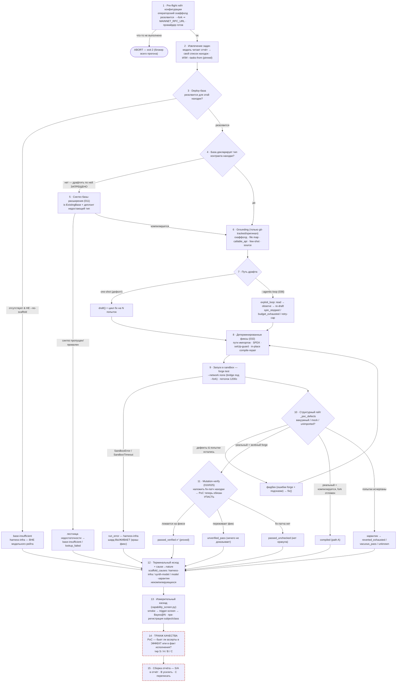

# Жизненный цикл PoC — сквозное флоу агента (текущее + задуманное)

> 🇬🇧 English version: [poc-lifecycle-flow.md](poc-lifecycle-flow.md)

Полный путь, который находка проходит через `scripts/poc_queue_runner.py`: от отчёта до
вердикта по находке, затем через измерительный слой и, наконец, до **триажа качества**,
который решает, что реально попадёт в отчёт. Стадии 1–13 **подключены и работают сегодня**;
стадии 14–15 — **где сегодняшнее суждение всё ещё ручное** — см.
[Куда ложится триаж качества](#куда-ложится-триаж-качества).

Детали внутреннего цикла draft→compile→fix: [poc-writing-flow.md](poc-writing-flow.md) (EN).
Учёт cause→nature: `scripts/scaffold_causes.py`. Измерительный каскад:
`scripts/capability_screen.py`. Требования оператора: [../poc-target-prerequisites.md](../poc-target-prerequisites.md) (EN).

Красный пунктир (14–15) = **не автоматизировано**: сегодня это ручное чтение (этого прогона —
`POC_TRIAGE.md`). Всё выше — код.

## Таблица стадий

| Стадия | Действия | Что необходимо для работоспособности | Что есть в коде сейчас |
|--------|----------|--------------------------------------|------------------------|
| **1 · Pre-flight гейт** | Отклонить заданный-но-нерезолвящийся `--test-scaffold` (опечатка); требовать `MAINNET_RPC_URL` под `--fork`; прогреть/проверить провайдера | Окружение оператора: `POC_PROJECT`, `POC_REPORT`, RPC (fork), ключ провайдера или поднятый Ollama | ✅ `_preflight_operator_scaffold`, проверки fork/провайдера в `main()` → `exit 2` (спека 001 FR-011) |
| **2 · Извлечение задач** | Модель читает отчёт и составляет свой список находок; либо загрузить pinned-список | Файл отчёта; модель; либо JSON `--tasks-from` | ✅ `extract_tasks` / `load_pinned_tasks`; сохраняется в `<target>/audit/poc/_extracted_tasks.json` |
| **3 · Резолв базы** | Авто-найти самую наследуемую `*Base` (или операторский скаффолд); отсутствие базы ⇒ short-circuit в `base-insufficient` до type-гейта | Git-tracked deploy-база **или** `--test-scaffold`; иначе честный environment-терминал | ✅ `resolve_scaffold`; short-circuit по отсутствию базы (`scaffold_absent`). **Спека 001** согласует формулировки доков/таксономии |
| **4 · Гейт недостающих типов** | Обнаружить, что база не декларирует state-переменную типа находки; запретить драфт по заведомо недостаточной базе | AST `SymbolIndex`; целевые stems находки | ✅ `scaffold_missing_types` (feature 040 FR-011) |
| **5 · Синтез скаффолда** | Синтезировать `is ExistingBase`, деплоящий недостающий тип, compile-валидировать, драфтить по нему если собирается; иначе разделить `base-insufficient` vs `lookup_failed` | Symbol index + lookup budget > 0; компилируемое расширение | ✅ `synthesize_scaffold` (011); `_insufficiency_ladder_outcome` |
| **6 · Grounding** | Собрать скаффолд + file map проекта + реальные сигнатуры `callable_api` + few-shot по другой находке + source | Только оригинальный (git-tracked) код цели — никогда answer-PoC | ✅ `_grounding`, `build_file_manifest`, `build_callable_api`, `resolve_example` |
| **7 · Драфт** | Либо one-shot `draft()` + цикл fix на N попыток, либо opt-in agentic read→observe→re-draft | Модель; `--agentic-loop` для пути B; бюджеты петли/spin/retry-cap | ✅ `draft` / `fix`; `_run_agentic_exploit_loop` + `exploit_loop.run` (036/037) |
| **8 · Детерминированные фиксы** | Механически исправить глубину импорта, SPDX, невиртуальный `setUp`, известные undeclared-импорты — кодом, не промптом | File map + symbol index | ✅ `_seq_postmodel`, `_seq_draft_inplace` (032); не тратит бюджет попыток |
| **9 · Запуск в sandbox** | `forge test` в `DockerSandbox` (`--network none` или bridge под `--fork`); потолок 600с, ×2 под fork | Foundry-образ (baked solc для offline); ≥6g памяти для `via_ir`; RPC для fork | ✅ `run_tests`, `_harness_sandbox`; `SandboxError`/`Timeout` → `run_error` (**краш-фикс**) |
| **10 · Структурный гейт** | Отклонить вакуумные / mock-цели / unimported PoC; классифицировать compiled vs green; вернуть ошибки forge + targeted/revert-подсказки в `fix()` | Эвристики дефектов; вывод forge | ✅ `_poc_defects`, `_targeted_hints`, `revert_hints`, детектор stall/repeat (042/045) |
| **11 · Mutation-verify** | Наложить fix-патч находки на эфемерную копию цели; настоящее доказательство теперь обязано УПАСТЬ. Переживает ⇒ `unverified_pass`; патча нет ⇒ `passed_unchecked` | **Реальный fix-патч** на находку (fix из отчёта или `--fix-patch`) — здесь только у H-01..H-05 | ✅ `mutation_verify` (010/025). **Оракул — но только там, где есть fix-патч** |
| **12 · Терминал + nature** | Эмитировать терминал попытки-находки с cause из замкнутого множества; map cause→nature; карантин некомпилирующихся PoC из `poc/` | Карта причин | ✅ `_finding_cause`/`_terminal_fields`; `scaffold_causes.cause_nature` (3 nature) |
| **13 · Измерительный каскад** | smoke (плюминг) → trigger-screen (сработал?) → Bayes@N по батарее; пре-регистрация subject/class, чтобы инфра-сбои не раздували рейт | Запись пре-регистрации; повторные прогоны для Bayes@N | ✅ `capability_screen.py` (`run_cascade`, `oracle_verdict_hash`, prereg) |
| **14 · Триаж качества** | Оценить, бьют ли ассерты PoC в **эффект** (дифференциально — упали бы, не будь бага) или лишь в **факт исполнения**; тир S/A/B/C | Человеческое чтение **или** тест-side мутационный оракул для находок без фикса (см. ниже) | ⚠️ **СЕГОДНЯ ВРУЧНУЮ** — кода нет. У `passed_unchecked` (нет fix-патча) нет автогейта |
| **15 · Сборка отчёта** | S/A в отчёт, B усилить, C переписать; приложить severity/предусловия | Человеческое суждение | ⚠️ **СЕГОДНЯ ВРУЧНУЮ** — кода нет |

## Куда ложится триаж качества

Измерительный слой (13) отвечает на *«сработал ли PoC?»* — форж-зелёный, не-вакуумный прогон.
Он **не может** ответить на *«доказывает ли ассерт заявленную уязвимость?»* для низов, потому
что у находки `passed_unchecked` **нет fix-патч-оракула**. Это семантическое суждение — стадия
**14**, и сегодня оно делается вручную (этот прогон: `where_are_we/<run>/POC_TRIAGE.md`, тиры
S/A/B/C по критерию эффект-vs-исполнение). Ложноположительный хвост, который ловит триаж
(`L-08` ассертит корректное поведение; `L-14` — happy-path deposit), проходит стадии 10–13 как
«сработало».

**Задуманная автоматизация (со временем).** `mutation_verify` (стадия 11) уже кодирует
правильную идею со стороны **фикса**: возмути мир (наложи фикс) и потребуй, чтобы PoC сменил
вердикт. Разрыв — со стороны **теста** для находок без fix-патча, а это ровно метаморфная
проверка: *мутируй сам эксплойт-шаг PoC и потребуй, чтобы он ПЕРЕСТАЛ триггерить.* Ассерт,
который всё ещё «проходит» после нейтрализации эксплойт-действия, бьёт в факт исполнения, а не
в эффект — режим отказа L-14, пойманный автоматически. Обобщение мутационного оракула с
«операторский fix-патч» до «мутация теста, авторская для харнесса» — вот что перевело бы стадию
14 из пунктира в сплошную; до тех пор каждый `passed_unchecked`-низ требует человеческого
оракульного чтения перед попаданием в отчёт.

## Как это читать

- **Стадии 1–13 честны в том, что они измеряют.** `trigger-screen` — верхняя граница
  кандидатов; `passed_verified` (стадия 11) — единственный *доказанный* исход, и ему нужен
  fix-патч, поэтому он ограничен находками, у которых он есть.
- **`base-insufficient` / `run_error` / `unknown` — это harness-infra**, вне модельного
  знаменателя: это environment-разрывы (отсутствующая база, стена fork 1200с, ревертящий
  скаффолд), а не промахи модели. Заряжаются только `lookup_failed` и причины nature `model`.
- **Краш-фикс (стадия 9) — это то, что делает длинный шардированный прогон надёжным**:
  `SandboxTimeout` одного исполнения теперь закрывает одну находку как `run_error`, а не убивает
  шард, молча теряя все находки-соседи после неё.
