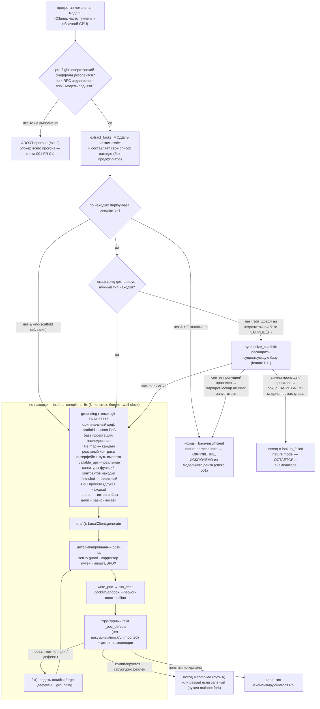

# Флоу написания PoC — `scripts/poc_queue_runner.py`

> 🇬🇧 English version: [poc-writing-flow.md](poc-writing-flow.md)

**Эксперимент на работоспособность PoC**: может ли локальная модель, ведомая хорошим честным
grounding-ом, автономно писать proof-of-code для *каждой* находки внешнего аудит-отчёта —
сама составляя свой список задач (детекция) и сама драфтя/чиня PoC? Отдельный скрипт (не
чат-оркестратор), который говорит с локальной моделью через Ollama и запускает каждый PoC в
сетево-изолированном sandbox.

Цель — её контракты, отчёт и сгенерированные PoC — живёт **целиком вне этого репо**
(`POC_PROJECT` / `POC_REPORT`); ничего таргет-специфичного сюда не коммитится.

**Требования оператора (target-side харнесс, RPC, ожидания по скаффолду):** см.
[../poc-target-prerequisites.ru.md](../poc-target-prerequisites.ru.md). Раннер наследует
deploy-базу проекта; он не бутстрапит полный стек протокола из пустого `test/`.

Разделение `base-insufficient` vs `lookup_failed` — это линия честности: **environment**-разрыв
(нет резолвящейся/синтезируемой базы, либо маршрут lookup не смог запуститься) покидает
знаменатель модели; **model**-промах (lookup запустился, а модель всё ещё не имела пригодного
деплоя) остаётся в нём. См. [../poc-target-prerequisites.ru.md](../poc-target-prerequisites.ru.md) §3.

## Как это читать

- **Модель делает работу end-to-end** — сама извлекает список находок (детекция) и сама драфтит
  + чинит каждый PoC. Оператор только запускает харнесс и даёт путь к цели; находки/PoC здесь
  никогда не пишутся вручную.
- **Grounding честен** — подаётся только собственный **git-tracked (оригинальный)** код цели;
  skill-сгенерированные PoC исключены, чтобы модели никогда не давали ответ. File map +
  callable_api противостоят привычке модели выдумывать имена интерфейсов / сигнатуры методов;
  скаффолд позволяет ей наследовать реальную deploy-базу проекта.
- **Детерминированные guard'ы бьют промпт на механических ошибках** — маленькая модель то и дело
  переопределяет невиртуальный `setUp` (4334) или выдаёт неверную глубину импорта / голую строку
  SPDX; это чинится в коде после генерации, а не оставляется промпту.
- **Планка успеха честна к sandbox** — PoC этой цели суть mainnet-fork тесты, которые не могут
  быть зелёными под `--network none`; поэтому путь A засчитывает PoC, который **компилируется и
  структурно реален** («compiled»), и только зелёный `forge`-прогон — это «passed»
  (`--require-pass`). Проход с вакуумным/замоканным тестом отклоняется гейтом.

См. [../poc-target-prerequisites.ru.md](../poc-target-prerequisites.ru.md) — чеклист оператора
перед прогоном, [../audit-agent.ru.md](../audit-agent.ru.md) — как драфт PoC связан с аудит-паком.
